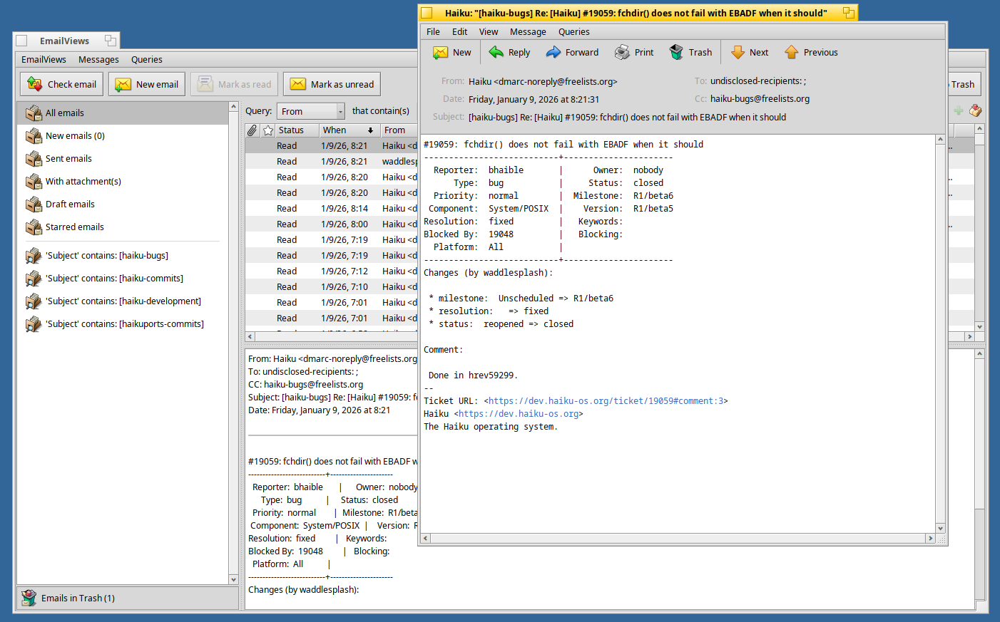

# EmailViews

A fast, lightweight email viewer for Haiku OS that uses live queries to organize and explore your emails.

## About

EmailViews is a native Haiku application that provides a three-pane email viewing experience with real-time updates. It integrates with Haiku's Mail Kit and leverages BFS attributes and live queries for efficient email organization.

## Features

- Query-based email organization (All, New, Sent, Drafts, Starred, With Attachments)
- Custom queries with Tracker integration
- Live updates via node monitoring
- Reply / Reply All / Forward (via Haiku Mail)
- Attachment preview, drag-and-drop, and save
- Email starring
- Deskbar replicant for new mail notifications
- Trash management

## This Repository

This repo is for **bug reports and feature requests only**. Source code is not yet public.

If want to test EmailViews, send an email to jorge at ilfelice.online.

This is beta software which may contain bugs. Use at your own risk.

## Prerequisite

- 64-bit Haiku operating system (developed under nightly version)
- Email accounts configured in Haiku's E-mail preferences
- zip package installed for email backup feature (pkgman install zip)

## Reporting Issues

Before reporting, please:

1. Check if the issue already exists
2. Test with the latest version

When reporting a bug, include:

- **Version:** (shown in About dialog)
- **Steps to reproduce:** What you did
- **Expected:** What should happen
- **Actual:** What happened instead
- **System info:** Haiku version (or build #)

For crashes, please attach the crash report if available.

## Feedback

General feedback and suggestions are welcome! Use the Issues tab with the "enhancement" label for feature requests.

## License

To be determined. Currently in closed testing.

---

Built for Haiku. Created with the assistance of AI tools. Maintained by Jorge Mare.
